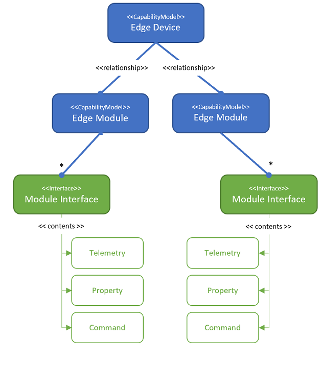
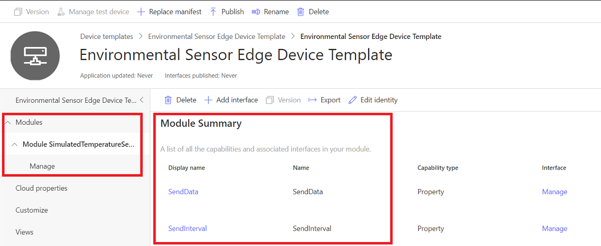
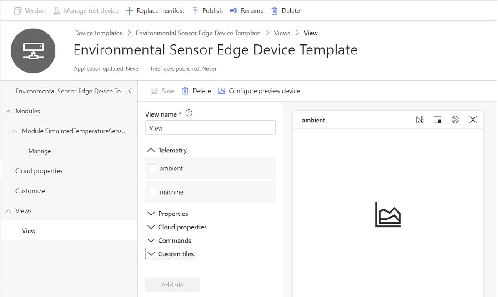
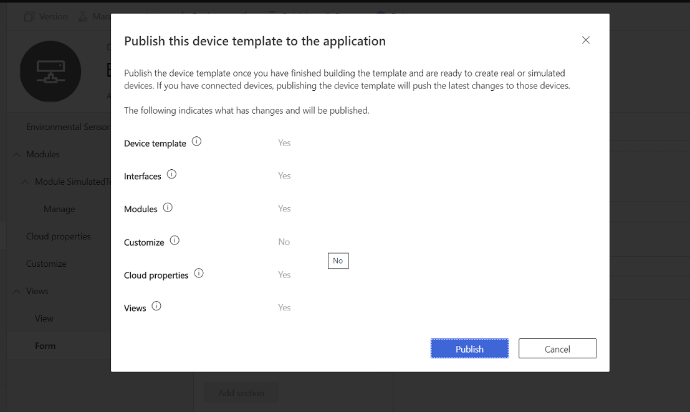
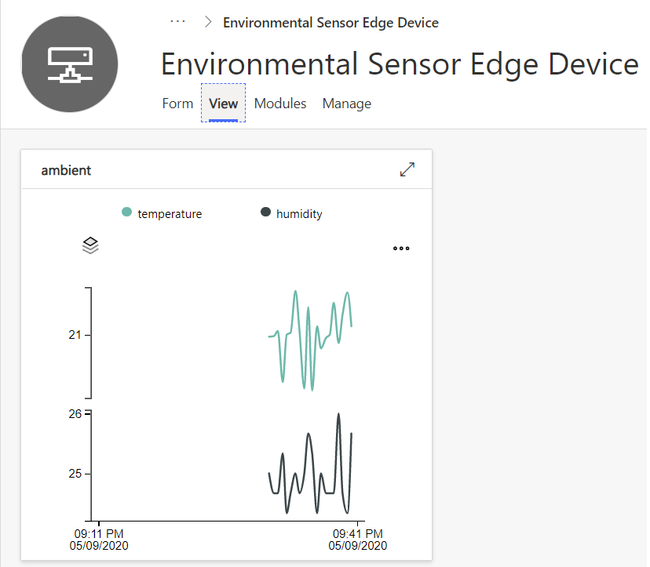
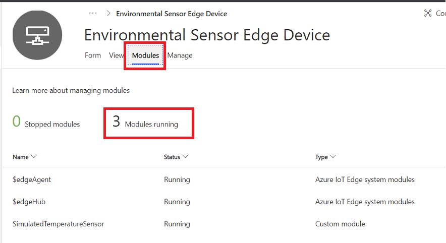

# Model and Connect Azure IoT Edge devices to an Azure IoT Central application

IoT Edge is made up of three components:

* IoT Edge modules are containers that run Azure services, partner services, or your own code. Modules are deployed to IoT Edge devices, and run locally on those devices.
* The IoT Edge runtime runs on each IoT Edge device, and manages the modules deployed to each device.
* A cloud-based interface enables you to remotely monitor and manage IoT Edge devices. IoT Central is the cloud interface.

A device template in IoT Central defines the capabilities of your device and IoT Edge modules. Capabilities include 
* telemetry the module sends 
* module properties and 
* the commands a module responds to.


In IoT Central  models an IoT Edge device as follows:

* Every IoT Edge device template has a device capability model.
* For every custom module listed in the deployment manifest, a module capability model is generated.
* A relationship is established between each module capability model and a device capability model.
* A module capability model implements module interfaces.
* Each module interface contains 
   * telemetry 
   * properties
   * commands



Download the IoT Edge manifest file from GitHub. Right-click on the following link and then select **Save link as**: [EnvironmentalSensorManifest.json](EnvironmentalSensorManifest.json)

## Create device template

In this section, you create a device template for an IoT Edge device that connects to your IoT Central application. You import an IoT Edge manifest to get started, and then modify the template to add telemetry definitions and views:

### Import manifest to create template

To create a device template from an IoT Edge manifest:

1. In your IoT Central application, navigate to **Device templates** and select **+ New**.

1. On the **Select template type** page, select the **Azure IoT Edge** tile. Then select **Next: Customize**.

1. On the **Upload an Azure IoT Edge deployment manifest** page, select **Browse** to upload the **EnvironmentalSensorManifest.json** you downloaded previously. Then select **Next: Review**.

1. On the **Review** page, select **Create**.

1. When the template has been created, change its name to *Environmental Sensor Edge Device*.

1. Select the **Manage** interface in the **SimulatedTemperatureSensor** module to view the two properties defined in the manifest:



### Add telemetry to manifest

An IoT Edge manifest doesn't define the telemetry a module sends. You must add the telemetry definitions to the device template. The **SimulatedTemperatureSensor** module sends telemetry messages that look like the following JSON:

```json
{
	"machine": {
		"temperature": 75.0,
		"pressure": 40.2
	},
	"ambient": {
		"temperature": 23.0,
		"humidity": 30.0
	},
	"timeCreated": ""
}
```

To add the telemetry definitions to the device template:

1. Select the **Manage** interface in the **Environmental Sensor Edge Device** template.

1. Select **+ Add capability**. Enter *machine* as the **Display name** and make sure that the **Capability type** is **Telemetry**.

1. Select **Object** as the schema type, and then select **Define**. On the object definition page, add *temperature* and *pressure* as attributes of type **Double** and then select **Apply**.

1. Select **+ Add capability**. Enter *ambient* as the **Display name** and make sure that the **Capability type** is **Telemetry**.

1. Select **Object** as the schema type, and then select **Define**. On the object definition page, add *temperature* and *humidity* as attributes of type **Double** and then select **Apply**.

1. Select **+ Add capability**. Enter *timeCreated* as the **Display name** and make sure that the **Capability type** is **Telemetry**.

1. Select **DateTime** as the schema type.

1. Select **Save** to update the template.

The **Manage** interface now includes the **machine**, **ambient**, and **timeCreated** telemetry types:


### Add views to template

The device template doesn't yet have a view that lets an operator see the telemetry from the IoT Edge device. To add a view to the device template:

1. Select **Views** in the **Environmental Sensor Edge Device** template.

1. On the **Select to add a new view** page, select the **Visualizing the device** tile.

1. Change the view name to *View IoT Edge device telemetry*.

1. Select the **ambient** and **machine** telemetry types. Then select **Add tile**.

1. Select **Save** to save the **View IoT Edge device telemetry** view.



### Publish the template

Before you can add a device that uses the **Environmental Sensor Edge Device** template, you must publish the template.

Navigate to the **Environmental Sensor Edge Device** template and select **Publish**. Then select **Publish** to publish the template:



## Add IoT Edge device

Now you've published the **Environmental Sensor Edge Device** template, you can add a device to your IoT Central application:

1. In your IoT Central application, navigate to the **Devices** page and select **Environmental Sensor Edge Device** in the list of available templates.

1. Select **+** to add a new device from the template. On the **Create new device** page, select **Create**.

You now have a new device with the status **Registered**:


### Get the device credentials

When you deploy the IoT Edge device later in this tutorial, you need the credentials that allow the device to connect to your IoT Central application. The get the device credentials:

1. On the **Device** page, select the device you created.

1. Select **Connect**.

1. On the **Device connection** page, make a note of the **ID Scope**, the **Device ID**, and the **Primary Key**. You use these values later.

1. Select **Close**.

You've now finished configuring your IoT Central application to enable an IoT Edge device to connect.

## Provision VM as an IoT Edge device 

To provision VM as an IoT Edge device:

1. Go back to Azure Portal select the VM you provisioned. In the **Support + troubleshooting** section, select **Serial console**.

1. Press **Enter** to see the `login:` prompt. Enter your username and password to sign in.

1. Run the following command to check the IoT Edge runtime version. At the time of writing, the version is 1.0.8:

    ```bash
    sudo iotedge --version
    ```

1. Use the `nano` editor to open the IoT Edge config.yaml file:

    ```bash
    sudo nano /etc/iotedge/config.yaml
    ```

1. Scroll down until you see `# Manual provisioning configuration`. Comment out the next three lines as shown in the following snippet:

    ```yaml
    # Manual provisioning configuration
    #provisioning:
    #  source: "manual"
    #  device_connection_string: "<ADD DEVICE CONNECTION STRING HERE>"
    ```

1. Scroll down until you see `# DPS symmetric key provisioning configuration`. Uncomment the next eight lines as shown in the following snippet:

    ```yaml
    # DPS symmetric key provisioning configuration
    provisioning:
      source: "dps"
      global_endpoint: "https://global.azure-devices-provisioning.net"
      scope_id: "{scope_id}"
      attestation:
        method: "symmetric_key"
        registration_id: "{registration_id}"
        symmetric_key: "{symmetric_key}"
    ```

1. Replace `{scope_id}` with the **ID Scope** for you made a note of previously.

1. Replace `{registration_id}` with the **Device ID** you made a note of previously.

1. Replace `{symmetric_key}` with the **Primary key** you made a note of previously.

1. Save the changes (**Ctrl-O**) and exit (**Ctrl-X**) the `nano` editor.

1. Run the following command to restart the IoT Edge daemon:

    ```bash
    sudo systemctl restart iotedge
    ```

1. To check the status of the IoT Edge modules, run the following command:

    ```bash
    iotedge list
    ```

    The output looks like the following:

    ```bash
    NAME                        STATUS           DESCRIPTION      CONFIG
    SimulatedTemperatureSensor  running          Up 20 seconds    mcr.microsoft.com/azureiotedge-simulated-temperature-sensor:1.0.8
    edgeAgent                   running          Up 27 seconds    mcr.microsoft.com/azureiotedge-agent:1.0.8
    edgeHub                     running          Up 22 seconds    mcr.microsoft.com/azureiotedge-hub:1.0.8
    ```

## View the telemetry

The simulated IoT Edge device is now running in the VM. In your IoT Central application, the device status is now **Provisioned** on the **Devices** page:


You can see the telemetry on the **View IoT Edge device telemetry** page:



The **Modules** page shows the status of the IoT Edge modules:

