## Build Azure Fucntion Module for Edge

### Install .NET Core

To create Azure Functions locally using Visual Studio Code you will need .NET Core. Complete the following steps to install .NET Core.

1. Open a browser and navigate to [.NET Downloads](https://dotnet.microsoft.com/download).

2. Select the **Windows** tab and click **Download .NET Core SDK**

    **Note**: We are using .NET Core **not** .NET Framework.

    Once the download has completed, continue.

3. Launch the downloaded Microsoft .NET Core installer and click **Install**.

    When the **User Access Control** prompt is displayed, click **Yes**.

4. Once the installation has completed, click **Close**.

5. Open a **Command prompt** and enter the following command:

    ```script
    dotnet --version
    ```

    You should see a response similar to:

    ```script
    C:\>dotnet --version
    2.2.100

    C:\>
    ```

    


#### Download Docker

Go To [Docker](https://docs.docker.com/install/) to Install Docker for Windows or Mac. 


#### Verify Installation


1. In the **Command Prompt** window, enter the following:

    ```command
    docker --version
    ```

    

### Create Azure Container Registry

In this section, we are going to use the Azure Portal to create a Azure Container Registry (ACR).

1. Open a browser and navigate to [Azure Portal](https://portal.azure.com)

2. Click on **Create a Resource** -> **Containers** -> **Container Registry**

    

3. Provide a unique name to your container registry, enable admin user and click **Create**

    

4. Once your registry is created go to resource for details

    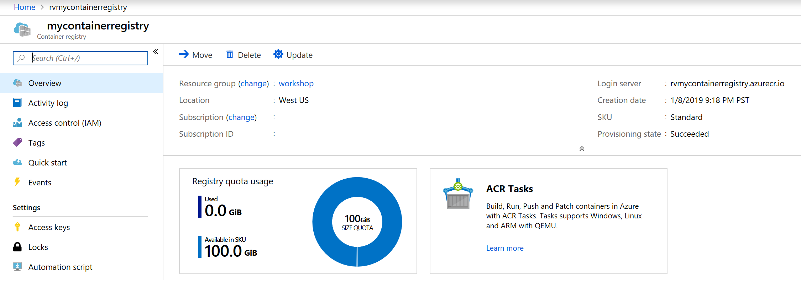


### Create a Function Project

The Azure IoT Edge extension for Visual Studio Code that you installed provides management capabilities as well as some code templates. You will use Visual Studio Code to create an IoT Edge solution that contains an Azure function.

1. In Visual Studio Code, open the Command Palette by pressing **CONTROL + SHIFT + P** and enter **Azure IoT Edge: New**.

    Choose **Azure IoT Edge: New IoT Edge Solution**.

    

2. A **Choose Folder** window will open, choose the location where you wish to create the solution.

3. In Visual Studio Code, under **Provide a Solution Name**, enter **EdgeFunction**.

    

4. Under **Select Module Template**, select **Azure Functions - C#**.

    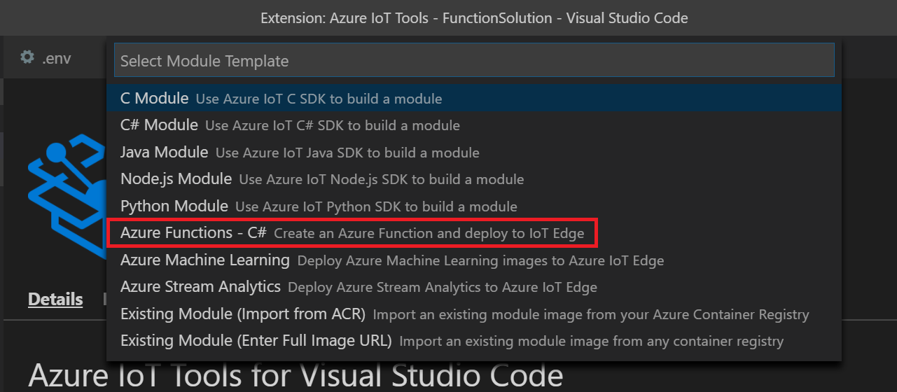

5. Under **Provide a Module Name**, enter **FilterFunction**.

    

6. Under **Provide Docker image repository for the module**, replace the value with the following:

    ```shell
    [registry name].azurecr.io/filterfunction
    ```

    Replace `[registry name]` with the registry name you created earlier. 

    **Note**: the repository name must be lowercase

    

7. New VS Code Window will be opened.

    

8. You will be prompted to set container registry crendetials. Click **Yes**

    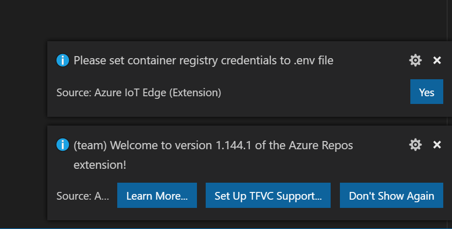

9. Opens a env file where you can set the credentials

    

10. Opens a env file where you can set the credentials

    

11. Get the credentials from the portal. Go to Container Registry you created and click on **Access Keys**. Pick the username and password. In the image below the username and password have been gerayed out. 

    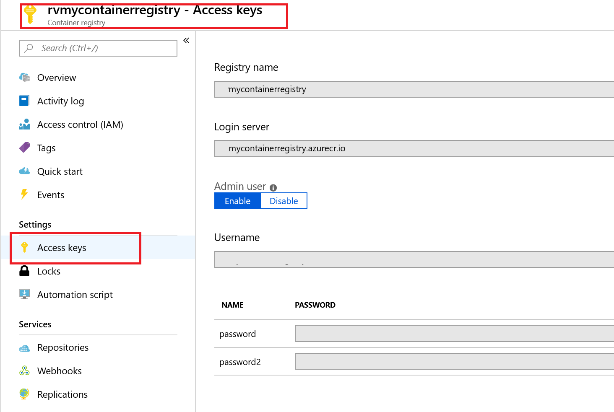


11. Replace the contents of the **FilterFunction.cs** file with the following code. Temperature Threshhold has been set to 20. When machine.temparature goes above threshhold message is output

    ```csharp
    using System;
    using System.Collections.Generic;
    using System.IO;
    using System.Text;
    using System.Threading.Tasks;
    using Microsoft.Azure.Devices.Client;
    using Microsoft.Azure.WebJobs;
    using Microsoft.Azure.WebJobs.Extensions.EdgeHub;
    using Microsoft.Azure.WebJobs.Host;
    using Microsoft.Extensions.Logging;
    using Newtonsoft.Json;

    namespace Functions.Samples
    {
        public static class FilterFunction
        {
            [FunctionName("FilterFunction")]
            public static async Task FilterMessageAndSendMessage(
                [EdgeHubTrigger("input1")] Message messageReceived,
                [EdgeHub(OutputName = "output1")] IAsyncCollector<Message> output,
                ILogger logger)
            {
                const int temperatureThreshold = 20;
                byte[] messageBytes = messageReceived.GetBytes();
                var messageString = System.Text.Encoding.UTF8.GetString(messageBytes);

                if (!string.IsNullOrEmpty(messageString))
                {
                    logger.LogInformation("Info: Received one non-empty message");
                    // Get the body of the message and deserialize it.
                    var messageBody = JsonConvert.DeserializeObject<MessageBody>(messageString);

                    if (messageBody != null && messageBody.machine.temperature > temperatureThreshold)
                    {
                        // Send the message to the output as the temperature value is greater than the threshold.
                        var filteredMessage = new Message(messageBytes);
                        // Copy the properties of the original message into the new Message object.
                        foreach (KeyValuePair<string, string> prop in messageReceived.Properties)
                        {filteredMessage.Properties.Add(prop.Key, prop.Value);}
                        // Add a new property to the message to indicate it is an alert.
                        filteredMessage.Properties.Add("MessageType", "Alert");
                        // Send the message.
                        await output.AddAsync(filteredMessage);
                        logger.LogInformation("Info: Received and transferred a message with temperature above the threshold");
                    }
                }
            }
        }
        //Define the expected schema for the body of incoming messages.
        class MessageBody
        {
            public Machine machine {get; set;}
            public Ambient ambient {get; set;}
            public string timeCreated {get; set;}
        }
        class Machine
        {
            public double temperature {get; set;}
            public double pressure {get; set;}
        }
        class Ambient
        {
            public double temperature {get; set;}
            public int humidity {get; set;}
        }
    }   
    ```

11. Save the changes to the of the **FilterFunction.cs** file.

12. If your project shows error do a **dotnet restore**. Open a terminal and go to your project modules folder and type in **dotnet restore**. Once done close the FilterFunction.cs file and reopen. 

    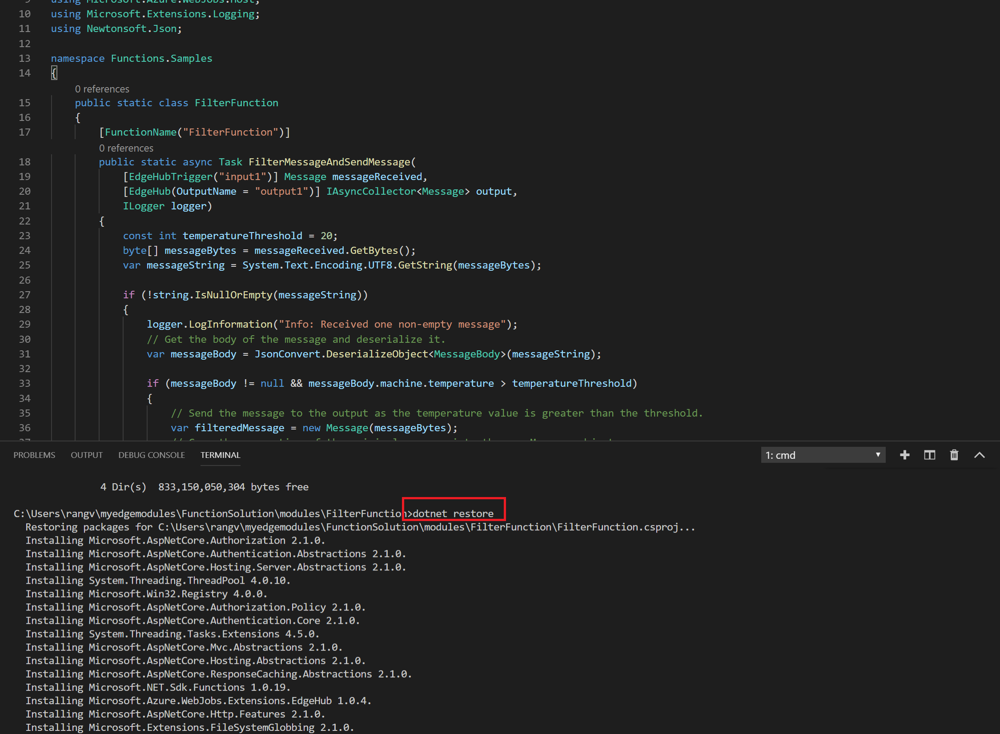

13. Open the VS Code integrated terminal by selecting View > Terminal.

14. Sign in to your container registry by entering the following command in the integrated terminal. 

    Use the username and login server that you copied from your Azure container registry earlier.

    ```shell
    docker login -u <ACR username> <ACR login server>
    ```

    When you are prompted for the password, paste the password for your container registry and press Enter.

    ```shell
    Password: <paste in the ACR password and press enter>
    Login Succeeded
    ```

    Hit **ENTER** to submit the password.

15. Open the **.env** file in your IoT Edge solution workspace. 

    This git-ignored file stores your container registry credentials so that you don't have to put them in the deployment manifest template. Provide the username and password for your container registry.

16. In the **.env** file, provide the username and password for the Azure Container Registry.

17. Save the changes to the **.env** file.

18. In the VS Code explorer, right-click the **deployment.template.json** file and select **Build and Push IoT Edge solution**.

    When you tell Visual Studio Code to build your solution, it first takes the information in the deployment template and generates a deployment.json file in a new folder named config. Then it runs two commands in the integrated terminal: docker build and docker push. These two commands build your code, containerize the functions, and then push the code to the container registry that you specified when you initialized the solution.

    You will see a lot of output generated during the process.

    

### View your Container Image

Visual Studio Code outputs a success message when your container image is pushed to your container registry. If you want to confirm the successful operation for yourself, you can view the image in the registry.

1. In a browser, open the Azure Portal [https://portal.azure.com](https://portal.azure.com).

    Login using your Azure Subscription if required.

2. In the **Search resources, services, and docs**, enter the name of the ACR  you created earlier, and then select it from the displayed list.

3. In the left hand nav area of the **Container registry** blade, under **Services**, click **Repositories**.

    You should see the **filterfunction** repository in the list.

4. In the list of repositories, click **filterfunction**.

    The **Repository** blade will open. In the Tags section, you should see the **0.0.1-amd64** tag. This tag indicates the version and platform of the image that you built. These values are set in the **module.json** file in the FilterFunction folder.


    


### New Deployment Manifest with Filter Function Module

Download the IoT Edge manifest file from GitHub. Right-click on the following link and then select **Save link as**: [EnvironmentalSensorManifestFF.json]

Update your Azure container registry in the deployment manifest 
    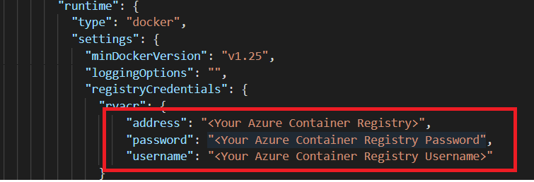

Update your Azure container registry image in filterfunction entry 
    


### Version Device Template to Add New Module
To add new module you will have to version the existing device template. Click on **Version**

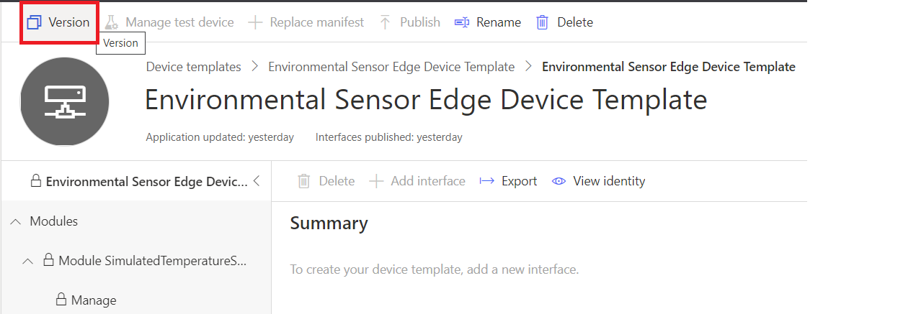

You will be presented with a modal, change the name if you choose to and Click **Create**


Click on **Add Module**
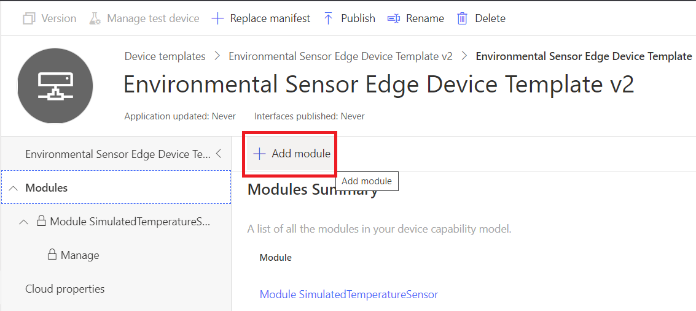


Click on **Custom Tile**
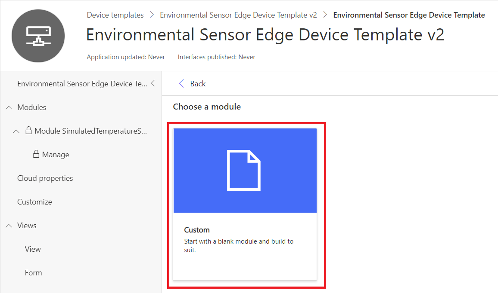

**Relationship Name** and **Name** should match module name **filterfunction**. Click **Save**. New module is created.


Add new capability to the filterfunction module. You need atleast one capability to save the interface


Click on **Replace Manifest** and Click **upload**. Select EnvironmentalSensorManifestFF.json file you downloaded and Click **Replace**. 
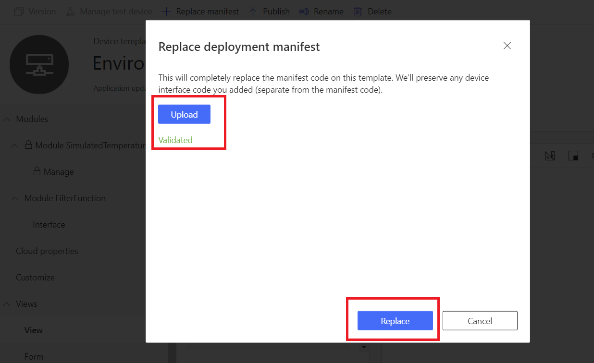


Click  **Publish** to publish device template. Go To Device explorer and go to the edge device and Click **Migrate**


Select the newly published Device template. 


This sends a new version of the deployment manifes to the edge device. Filter function is now running on the edge device.
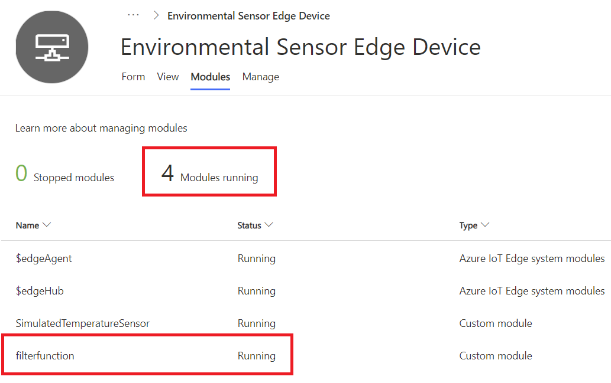


Go to Linux box to verify that Filter Function module is running on the edge device.


