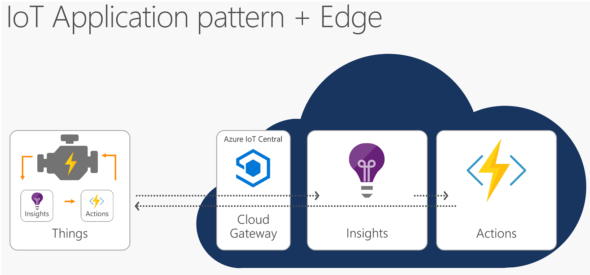

# IoT Edge Pattern

Cloud Analytics are deployed down to IoT Devices to run them locally so that your business still operates reliabily even when connectivity is not consistent. In edge you are getting similar insights as the cloud.
  

Steps involved in building this pattern include 

1. Create IoT Central Application
    * Create an Azure IoT Central Application

2. Create Azure Services and solutions to be deployed on the Edge. Azure Services which can run on the cloud include
    * Azure Stream Analytics
    * Azure Functions
    * Azure Machine Learning
    * Azure Cognitive Services
    * Azure Event Grid
    * Azure Blob Storage

3. Create containers and store them in a container registry like Azure Container Registry

4. Create a deployment manifest using Visual studio code or Visual studio, upload to IoT Central during Edge device template creation.

5. Save and publish edge device template

6.  Create Edge device   
    * Identify a device to run edge capabilities and install Azure IoT Edge runtime
    * Provision and Connect Edge device to IoT Central

7. Deployment manifest and associated containers are deployed to the edge device to capture insights and take actions.
